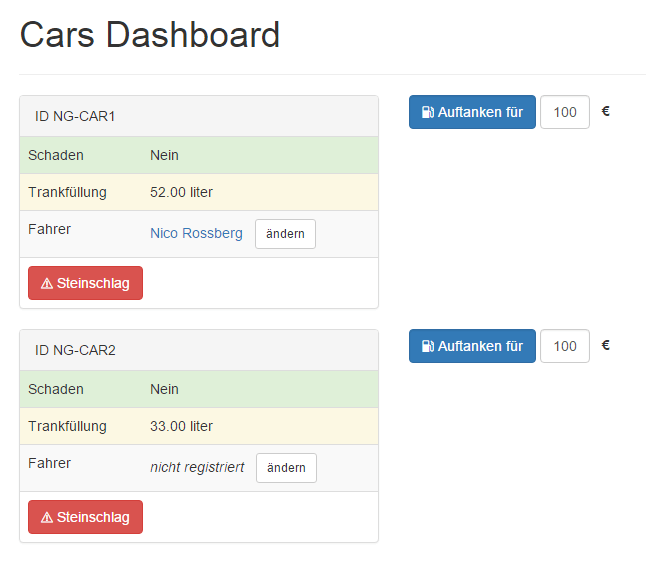

# Angular2 Routing -- Beispiele

Beispiele für das Routing mit Angular2.  
In diesem Verzeichnis finden Sie das im Artikel gezeigte Beispiel unter `src/`.



## Setup & Start

Alle gezeigten Kommandozeilen-Befehle setzen voraus, dass [Node.js](https://nodejs.org/) installiert ist.

```cmd
npm install
npm start
```

Der Befehl `npm start` ruft `ng serve` auf.
Der Befehl `ng serve` ist Teil der [Angular-CLI](https://github.com/angular/angular-cli) und startet die Anwendung unter `http://localhost:4200`. 
Für ein vereinfachtes Debugging können Sie das Kommandozeilen-Tool mit `npm install -g angular-cli` global installieren.

## Alle Beispiele der Fachartikelreihe

* [Teil 1 – Modularer Code mit SystemJS und jspm](https://github.com/Angular2Buch/angular2-module)
* [Teil 2 – Templatesyntax und Web Components](https://github.com/Angular2Buch/angular2-template-syntax)
* [Teil 3 – Dependency Injection und Unit-Testing](https://github.com/Angular2Buch/angular2-testing)
* [Teil 4 – Formularverarbeitung und Validierung](https://github.com/Angular2Buch/angular2-forms)
* __[Teil 5 – Routing](https://github.com/Angular2Buch/angular2-routing)__ 